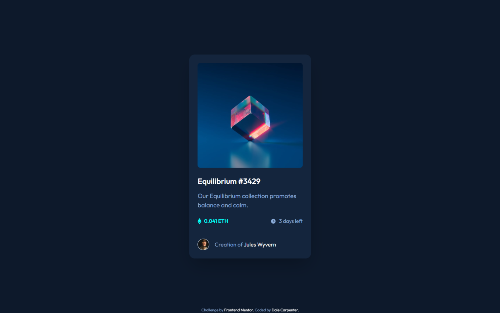

# Frontend Mentor - NFT preview card component solution

This is a solution to the [NFT preview card component challenge on Frontend Mentor](https://www.frontendmentor.io/challenges/nft-preview-card-component-SbdUL_w0U). Frontend Mentor challenges help you improve your coding skills by building realistic projects.

## Table of contents

- [Overview](#overview)
  - [The challenge](#the-challenge)
  - [Screenshot](#screenshot)
  - [Links](#links)
- [My process](#my-process)
  - [Built with](#built-with)
  - [Continued development](#continued-development)
  - [Useful resources](#useful-resources)
- [Author](#author)

## Overview

### The challenge

Users should be able to:

- View the optimal layout depending on their device's screen size
- See hover states for interactive elements

### Screenshot

### Links

- Solution: [Link](https://www.frontendmentor.io/solutions/mobilefirst-with-tailwind-and-postcss-1yE844e95T)
- Live Site: [Link](https://630745aa6a5de06c523f4e05--effortless-dusk-1624a2.netlify.app/)

## My process

### Built with

- Semantic HTML5 markup
- Flexbox
- CSS Grid
- Mobile-first workflow
- [tailwindcss](https://tailwindcss.com/) - A utility-first CSS framework
- [PostCSS](https://postcss.org/) - A tool for automating routine CSS tasks with Javascript plugins
  - [Autoprefixer](https://github.com/postcss/autoprefixer) - For adding vendor prefixes to improve browser compatibility
  - [cssnano](https://cssnano.co/) - Minifies CSS to reduce file size.

### Continued development

As this is my first time using Tailwind, I would like to continue exploring it's application in future projects, particularly the implementation of a full custom design system in the config file for a larger scale project.

### Useful resources

- [Polypane](https://polypane.app/) - A web browser specifically for developers. Although not a true replacement for Chrome, it provides an incredible suite of tools for devs. Outlining, accessibility, checking best practices, viewing all layouts in a single window and much more.
- [tailwindcss Official Docs](https://tailwindcss.com/docs/installation) - Some of the best official documentation I've ever read. Clear, concise and thorough. Rendered additional tutorials completely unnecessary.

## Author

- Frontend Mentor - [@dalecarpenter](https://www.frontendmentor.io/profile/dalecarpenter)
- Twitter - [@coderCarpenter](https://www.twitter.com/coderCarpenter)
